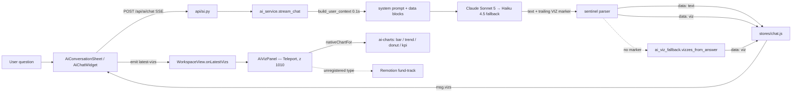

# AI Charts (viz) — how an answer becomes a graph

> Scope: the in-app AI assistant's charts ("הראה לי גרפים של…"). Written 2026-09-22
> after a report that the AI answered with tables and **no graph opened**.
> Companion to `docs/ARCHITECTURE.md` §6 (Claude invariants).

## 1. The chain, end to end

| Step | File | What it does |
|---|---|---|
| Contract | `backend/app/services/ai_service.py` → `SYSTEM_PROMPT` "תצוגה חזותית (viz)" | Tells the model to append `<<VIZ:{json}>>`, up to 3 per answer. The type list is generated from `VIZ_TYPES` (bar, trend, donut, kpi, fund-track); JSON braces are doubled because of `.format()`. |
| Parse | `ai_service.stream_chat` | State machine strips the marker from visible text, emits `data: {"viz": …}`. Holds back only a real partial `<<VIZ:` prefix. |
| Safety net | `backend/app/services/ai_viz_fallback.py` | If the model skipped the marker: rebuilds bar charts from the markdown tables **in the answer itself**. Fires when the question asks for a chart (גרף/תרשים/דיאגרמה…) or a table has ≥5 rows. Tagged `"source":"table-fallback"`. |
| Validate | `ai_answer_validator.py` | Flags ₪ amounts in the answer that are absent from the context (yellow chip). |
| Receive | `frontend/src/stores/chat.js` | Pushes each viz into `msg.vizs[]` (carousel) and `msg.viz`. |
| Surface | `AiConversationSheet.vue`, `AiChatWidget.vue` | Emit `latest-vizs` whenever the newest assistant message has vizzes. |
| Mount | `views/WorkspaceView.vue` | **One** `AiVizPanel` at the view root, serving home *and* content mode. |
| Render | `AiVizPanel.vue` → `components/ai-charts/AiChart.vue` (registry) | Registered types render as native Vue charts with hover and a table view. Anything unregistered (fund-track) still plays in Remotion (`remotion/index.ts::componentForViz`; gotchas: memory `ai_viz_remotion.md`). |

`ProductionComparison.vue` has its **own** sheet + panel pair (self-contained, not the workspace one).

## 2. Why the graph did not open (2026-09-22) — three independent faults

| # | Fault | Evidence | Fix |
|---|---|---|---|
| 1 | `AiVizPanel` was mounted **only inside the home-mode block**. The right-rail AI widget lives in content mode, so its viz set `aiVizOpen=true` on a panel that did not exist. | Local SSE replay of the exact question returned 2 `viz` events; the UI showed nothing. | Panel moved to the `WorkspaceView` root. Verified with Playwright: emails tab → AI widget → question → panel open. |
| 2 | Primary model `claude-sonnet-4-20250514` is **retired (404)**. Every answer burned 2 failed attempts + 3s backoff, then was answered by Haiku, the weakest at honouring the marker. | Direct API call → `NotFoundError`. | `claude-sonnet-5` ×2 → `claude-haiku-4-5`. |
| 3 | The chart depends on the model *remembering* a text marker; nothing enforced it. `max_tokens=2048` could also truncate a long Hebrew answer before the trailing marker (the drain drops a half marker silently). | "NO VIZ emitted" log line existed but nothing acted on it. | `ai_viz_fallback.py` safety net; `max_tokens=8192`; `stop_reason=max_tokens` now logged. |

Unrelated console noise in the same report: the `<g transform="scaleY(…)">` errors came from
`remotion/TabHeroLoops.tsx` (paper-plane flap). SVG's `transform` **attribute** has no
`scaleY()` — only CSS does. Now `scale(1 ${flap})`. The `CompanyLogo`/`quickEmail`/`step`
warnings were a hot-reload caught mid-edit of `CompanyEmailsTab.vue`; the file on disk is clean
and the rendered tab logs no errors.

## 3. Latency — why ~15s

Measured on the chart question (Sonnet 5, 11.3k input tokens):

| Phase | Time |
|---|---|
| DB context build | 0.08s |
| First visible text | ~3s (1.2s with thinking disabled) |
| Full answer | ~15s, **~1,100 output tokens** |

The cost is output: the model writes every number **twice** — a full markdown table, then
the same rows again as VIZ JSON — and the chart JSON is written **last**, so the graph opens
at the very end. Thinking is not the bottleneck (disabling it saves ~2s).

Before the fix it was worse: the two dead Sonnet-4 attempts added round-trips + 3s sleep.

## 4. Professional bar — recommended next steps

1. **Chart first, short text.** When a viz carries the data, emit `<<VIZ:…>>` *before* the
   prose and replace the full table with 2-3 insight lines (the parser already handles a
   marker anywhere). Expected: graph opens in ~4-5s, answer ~half the tokens.
2. **Tool use instead of a text marker.** A `render_chart` tool with a strict JSON schema
   (`strict: true`, `tool_choice: auto`) gives schema-valid charts and removes the
   brace-escaping and chunk-boundary parser. The table fallback stays as the safety net.
3. **Prompt caching.** The ~11k-token system prompt is mostly static rules; put the rules in
   a cached block and the per-user data after it.
4. **Chart hygiene.** Consistent titles (metric + scope + period), ₪ formatting, one
   highlight, an `insight` line on every chart; ranks never plotted as values.

## 5. Invariants — do not break

- The viz panel is mounted **once**, at the `WorkspaceView` root. Never inside a mode-specific `v-if`.
- Chart values come **only** from context or from the visible answer (fallback). Never computed or invented client-side.
- Model IDs come from the current model table (`claude-api` skill), never from memory. A 404 on the primary looks like "the AI got dumber", not an error.
- In SVG `transform` **attributes** use `scale(x y)` / `translate(x y)` / `rotate(a)`, not CSS `scaleY()`/`translateX()`.

**Verify:** `curl -N localhost:8000/api/ai/chat` with a JWT and the question → expect `"viz"` events;
then the Playwright flow in memory `ui_render_check_harness.md` (content tab → `.aiw` → ask → `.ai-viz-card` visible).

## 6. The chart kit — `frontend/src/components/ai-charts/`

Native Vue, no new dependencies. The design language comes from visx bar charts, the
heat-strip and padded donuts, rebuilt without React/Tailwind. Tailwind's preflight reset
would restyle the whole app.

| Type | Component | Use for | Design |
|---|---|---|---|
| `bar` | `AiBarChart.vue` | rankings: clients, companies, products | Emphasis form: the highlighted row gets the full hue, the rest a lighter step of the same hue. Bars are 18px with a 4px rounded data end; hairline grid, round ticks, staggered grow. Hover fades the other bars and shows a tooltip with rank and share. All-negative data ("biggest declines") is plotted by magnitude with the sign kept. |
| `trend` | `AiTrendChart.vue` | month / quarter / year series | Heat-strip: height and opacity scale with the value, the latest column in full hue. Stats row: total, peak, latest, % change. Hover shows the change vs the previous point. Time runs left→right like every other chart in the app. |
| `donut` | `AiDonutChart.vue` | part-to-whole | Validated `CHART_PALETTE` in fixed order, 7-slice cap, then "אחרות" (in `--chart-absent`). 2px surface gap between slices; hover is synced with the legend and updates the centre label. |
| `kpi` | `AiKpiChart.vue` | one headline number | 56px hero figure that counts up. Direction is shown as icon + word, never colour alone. |

Every type has a **table view** (header button), so no value is only reachable by hover or
colour. Shared: `format.js` (₪ full/compact, nice ticks, tones, reduced motion) and the
`.ai-chart-insight` line.

### Adding a chart type (e.g. `compare` for before→after)

1. `frontend/src/components/ai-charts/AiCompareChart.vue`: one `viz` prop, text in ink
   tokens (never the data colour), respect `prefersReducedMotion()`.
2. `registry.js`: `compare: { component: AiCompareChart, table: … }`. Add any alias the
   model might improvise to `ALIASES`.
3. `backend/app/services/ai_service.py` → `VIZ_TYPES`: add `{type, when, example}`. The
   prompt section is generated from it, so the model learns the type automatically.
4. Optional: teach `ai_viz_fallback.py` to recognise the shape in a markdown table.
5. Render it: push a fixture into the chat store and screenshot the panel (see
   `render_kit.py` pattern: `pinia._s.get('chat').messages.push({role:'assistant', vizs:[…]})`).

### RTL gotcha (hit while building)

Position marks with **physical** `right:` in these RTL charts. `inset-inline-start`
resolves against the element's *own* direction, so inside a `.ltr-number` span (direction
ltr) it flips: the axis read ₪40K at the baseline and ₪0 at the far end.
