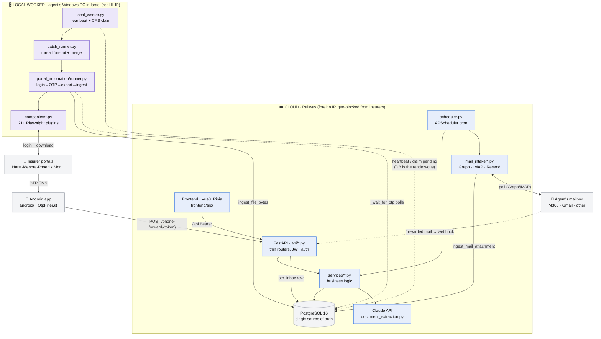
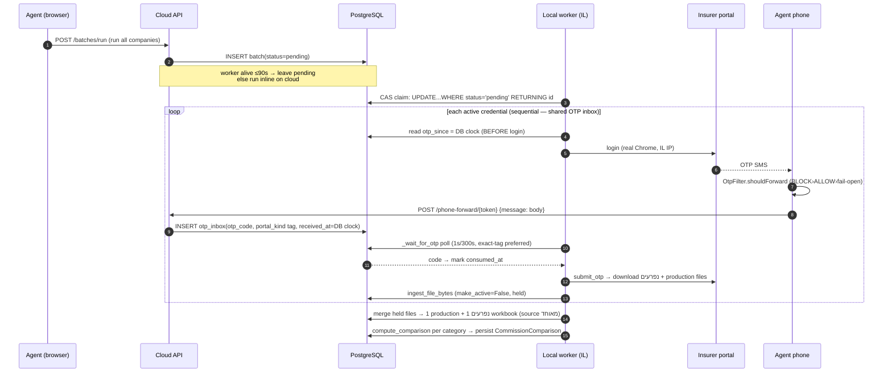
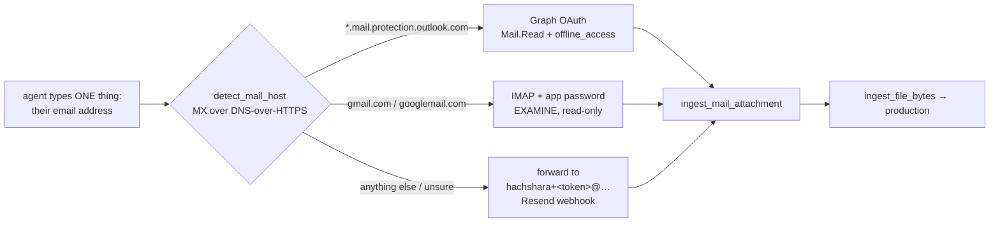
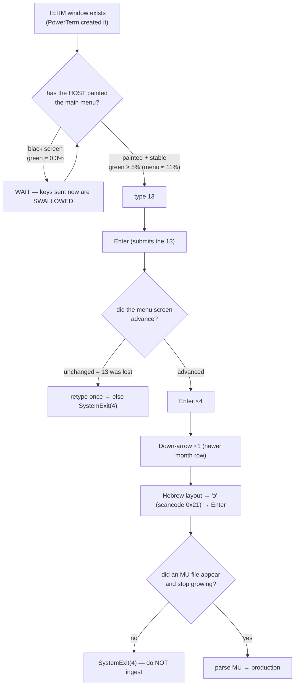
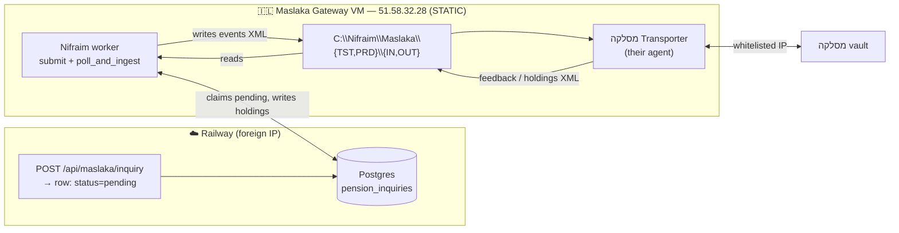

# Nifraim — Architecture Map

> **Purpose of this file.** A machine-readable map of the app so any Claude Code
> session can orient itself *without* being re-briefed. Read this first. The
> Mermaid graphs below render visually on GitHub and encode the module graph +
> data flows; the **Navigation Index** tells you which file owns each concern.
>
> Pair with `CLAUDE.md` (conventions, pitfalls, how-to-add-a-parser). This file
> answers **"how is it wired and where do I look"**; `CLAUDE.md` answers **"how
> do I write code that fits."**

---

## 0. One-paragraph mental model

Nifraim reconciles **production** (what the agent sold — premium/accumulation)
against **נפרעים / commission** (what each insurer actually paid). Files arrive
three ways: manual upload, **hands-free portal automation**, or — for the one
insurer that emails instead of publishing (הכשרה production) — **mail intake**
(§10). Because Israeli
insurer WAFs geo-block the cloud IP, automation runs on **two planes**: the
**cloud** (Railway — UI, DB, Claude, analytics) is the brain; a **local worker**
on the agent's Windows PC in Israel is the hands. They never call each other
directly — the **PostgreSQL database is the only rendezvous**. OTP codes flow
from the agent's phone → cloud inbox → worker.

---

## 1. System graph (the two planes)



**Not everything comes from a portal.** הכשרה never publishes production in its agent
portal — it **emails** a `Ild_prod_*.zip`. That harvest runs on the **cloud**, not
the worker: mail hosts aren't geo-blocked, so none of the two-plane machinery
applies. See §10.

**Dispatch rule** (`api/portal_automation.py::_should_defer_to_worker`): if the
user's worker heartbeated ≤ **90 s** ago (or global `WORKER_MODE`), a batch stays
`pending` for the worker to claim; otherwise it runs **inline on the cloud**
(where IL portals fail). Installing + running the worker is the only switch.

**Worker identity is a TOKEN, not a machine — and machines are not interchangeable.**
`local_worker.py` resolves *whose* worker it is from `WORKER_LOG_TOKEN` in its local
`.env` (= `users.phone_forward_token`). Run one agent's installer link on a second PC
and that PC becomes a full copy of their worker: it heartbeats as them, claims their
batches, logs into the insurers with their credentials, and writes their clients'
files to its own disk. Atomic claims stop double *execution*; they say nothing about
*which machine* executes — and only a machine with the Ericom PowerTerm client can
open Phoenix's green terminal (§ Windows-native terminal). Shipped incident: an
agent's token was installed on a colleague's laptop, `worker_heartbeats.hostname`
flipped with whichever PC was on, and Phoenix "randomly" worked or didn't for weeks.
Invariants:
1. **`worker_heartbeats.approved_hostname` pins an account to one machine.** Any other
   machine refuses to beat and refuses to claim. `NULL` = unpinned = original
   behaviour, so nobody can be locked out.
2. **One owner at a time.** The `ON CONFLICT … WHERE` guard in `_beat` decides
   ownership atomically (take the row if it's ours, or its owner went stale >90 s), so
   two PCs cannot flip-flop the hostname. The loser stands by; it never claims.
3. **Only the owner self-updates** — `_maybe_self_update` *clears* the flag, so a
   standby consuming it would strand the working machine on stale code.

---

## 2. Navigation index — "where do I look for X"

| I need to change / understand… | Go to |
|---|---|
| **Parse a new insurer Excel format** | `services/parser_service.py` + `utils/hebrew_mappings.py` (see CLAUDE.md "How to Add a Parser") |
| **Hebrew → DB column mapping / format signatures** | `utils/hebrew_mappings.py` |
| **Which reporting month a file is *for*** | `parser_service.py::detect_period_month` |
| **Commission ↔ production matching (paid/unpaid)** | `services/comparison_service.py::compute_comparison` |
| **"Full picture" multi-company comparison** | `services/comparison_orchestrator.py::compute_merged_comparison` |
| **Upload + auto-compare pipeline** | `services/upload_ingest.py::ingest_file_bytes`, `schedule_post_ingest` |
| **Record-level reconciliation & analytics** | `services/reconciliation_service.py` |
| **A single portal run (login→OTP→export)** | `services/portal_automation/runner.py::_run_inner` |
| **"Run all companies" batch** | `services/portal_automation/batch_runner.py::_run_batch_inner` |
| **A specific insurer's automation** | `services/portal_automation/companies/<name>.py` |
| **Which fields the "הוסף פורטל" form shows** | `companies/__init__.py::PORTAL_LOGIN_FIELDS` → `/portal-kinds` → `PortalCredentialModal.vue` |
| **Merge per-company files into one workbook** | `services/portal_automation/aggregate.py` |
| **הכשרה production (emailed zip, no portal)** | `services/hachshara_prod/` + §10 |
| **Which mail path an agent gets (M365/Gmail/other)** | `services/mail_intake/detect.py::detect_mail_host` |
| **The one seam mail uses to reach ingest** | `services/mail_intake/__init__.py::ingest_mail_attachment` |
| **Microsoft consent / Gmail IMAP / Resend webhook** | `services/mail_intake/{graph,gmail,resend}.py`, `api/mailbox.py` |
| **Local worker lifecycle / self-update** | `backend/local_worker.py` |
| **Worker endpoints (bundle, heartbeat, update, log)** | `api/portal_automation.py` (`/worker/*`) |
| **OTP webhook / templates / next-otp** | `api/portal_automation.py` (`/phone-forward/*`) |
| **OTP company routing from SMS text** | `services/otp_routing.py::match_otp_company` |
| **Android SMS forwarder logic** | `android/app/.../smsforwarder/OtpFilter.kt`, `SmsReceiver.kt` |
| **Global SMS OTP templates (CRUD/seed)** | `api/sms_otp_templates.py`, `models/sms_otp_template.py` |
| **Claude agreement/rate extraction** | `services/document_extraction.py`, `api/ai_documents.py` |
| **How extracted rates are picked for math** | `services/rate_select.py` |
| **AI chat (streaming)** | `services/ai_service.py::stream_chat` |
| **Customer portal (shareable link)** | `services/portal_service.py`, `api/portal.py`, `CustomerPortalView.vue` |
| **Phoenix native terminal (green-screen)** | `scripts/windows/phoenix_terminal_run.py`, `services/phoenix_mu.py` |
| **Volume report (דוח היקפים, multi-sheet)** | `parser_service.py::_parse_volume_report`, `services/volume_service.py` |
| **Scheduled jobs (cron)** | `backend/app/scheduler.py` |
| **CSS design tokens / RTL root** | `frontend/src/App.vue` (`:root`) |
| **Main workspace UI (5 tabs)** | `frontend/src/views/WorkspaceView.vue` |
| **Comparison dashboard UI** | `frontend/src/components/comparison/ComparisonDashboard.vue` |
| **Workspace tab bar (home cards + strip) + hover FX** | `frontend/src/components/workspace/WorkspaceTabs.vue` |
| **Tab icons (duotone) — single source of truth** | `frontend/src/components/icons/{AppIcon.vue, tabIcons.js}` |
| **Per-tab colour identity tokens** | `App.vue` `:root` (`--tab-*` accent/wash/ink) |
| **Card ambient hover animation (Remotion)** | `remotion/CardAmbientLoop.tsx`, `components/workspace/CardAmbientIsland.vue` |
| **User-to-user chat (messenger)** | `api/messenger.py`, `models/dm_*.py`, `stores/messenger.js`, `components/workspace/MessengerDock.vue` |
| **Who is online (a PERSON, not a worker PC)** | `models/dm_presence.py` (50s) — contrast `worker_heartbeat.py` (90s) |
| **A user's public handle / directory search** | `users.username`, `services/username_service.py` |
| **Generated avatar (seed → palette + character)** | `utils/avatarSeed.js`, `utils/avatarFace.js` — shared by `Avatar.vue` **and** `remotion/AvatarLoop.tsx` |
| **Delete a conversation (per-side)** | `api/messenger.py::delete_thread`, `dm_conversations.*_cleared_at` |

---

## 3. Hands-free harvest — end-to-end sequence



---

## 4. OTP correctness invariants (do NOT break these)

These look arbitrary; each encodes a fixed production incident.

1. **Anchor `otp_since` on the DB clock, before `login()`.** Not the worker's
   clock (a PC 5 min fast discarded every real code). Before login because some
   portals SMS on credential-submit. — `runner.py::_wait_for_otp`, `_db_utc_now`
2. **Exact company tag beats NULL, via `CASE` sort.** A naive
   `ORDER BY (portal_kind==base) DESC` lets untagged junk (NULL sorts first under
   DESC) steal the code. Codes tagged for *other* companies are excluded. Stops
   cross-company OTP theft in a run-all batch. — `runner.py`, mirrored in `/next-otp`
3. **Body-only forwarding.** The phone drops the sender, so the backend
   re-derives company from body text. Device (`OtpFilter.kt`) and server
   (`otp_routing.py`) share the one **global** `sms_otp_templates` set.
4. **Fail-open on the phone.** Any unlisted-company SMS with a 4–8 digit code is
   still forwarded, so a new insurer never silently drops. BLOCK templates are
   the privacy lever for personal 2FA.

## 4b. Credentials — the login form is DECLARED, not assumed

`portal_credentials` has exactly two value columns (`username` +
`encrypted_password`). Real insurer login forms don't agree with that shape: **מור
asks for THREE fields** — מס' רשיון + ת"ז + טלפון — and `mor.py::_split` reads them
back out of a *packed* `username="<license>|<id>"` and `password="<phone>"`.

The packing used to be invisible to the UI: "הוסף פורטל" rendered a hardcoded שם
משתמש + סיסמה, so a user adding מור had **no field for the phone** — the number Mor
SMS-OTPs. The credential was unenterable, and only rows hand-packed for the dev
account worked. Invariants:

1. **A portal that needs non-default fields declares them** in
   `companies/__init__.py::PORTAL_LOGIN_FIELDS`; `/portal-kinds` ships the spec and
   `PortalCredentialModal.vue` renders it. No portal-specific branching in the Vue.
2. **`target` + list order ARE the packing convention.** Fields sharing a `target`
   are joined with `"|"` in spec order — precisely what the plugin's `_split()`
   parses. Reorder the spec and you silently swap רשיון with ת"ז.
3. **`secret: True` never round-trips.** The password column is encrypted, so those
   fields render blank on edit and blank means *leave unchanged* — never overwrite a
   stored secret with an empty string.

## 4c. Score-gated portals (Mor, Meitav) — the browser must look like a human's

Mor and Meitav are gated by a **reCAPTCHA score**. Nothing about the request is wrong when
they refuse it: Mor answers `400 {"resultCode":"Bad Request"}` — visible to the agent as the
generic `אירעה שגיאה` — to a perfectly formed login. Everything here was established by
measurement on 2026-07-20, after ~9 hypotheses died; the section it replaces asserted a cause
(cold profiles) that is now **refuted**, and that wrong entry is what cost most of the day.

### Status: BOTH PORTALS CONFIRMED WORKING (2026-07-20, agent's worker)

```
מור     success  490 records  מור נפרעים 05-2026.xlsx      period 2026-05
מיטב    success    9 records  מיטב דש עמלות לסוכן.xlsx     period 2026-05
```
Both deliver **נפרעים**, not production — they are gemel/pension houses, so their production
belongs to מסלקה (§12). Fixing them does not move the production totals.

### The configuration that PASSES — do not drift from it

Reproduced green twice from a dev box (`201 {"resultCode":"Success"}` + OTP modal), with real
Windows **Edge** and real Windows **Chrome**, driving our own login flow:

| Setting | Value | Why |
|---|---|---|
| `headed` | `True` | headless is refused outright |
| browser | real Chrome/Edge | bundled Chromium reports `sec-ch-ua: "Chromium"` — a bot brand |
| `--disable-blink-features=AutomationControlled` | **always** | makes Chrome not set `navigator.webdriver`; genuinely false, nothing left to detect |
| `navigator.webdriver` JS patch | **never** for native | `defineProperty` IS detectable (descriptor + `getter.toString()`) |
| `no_viewport` + `--start-maximized` | headed runs | a pinned viewport on a headed browser disagrees with the OS window — a mismatch no real browser shows |
| profile | fresh, **unwarmed** | both winning runs used a brand-new throwaway profile |
| warm-up | **off** (`mor.py`, `_skip_warmup`) | synthetic mouse dwell is itself a signal, and both winning runs did none |

`runner.py` applies the flag/viewport/profile rules; the per-plugin flags are `headed`,
`native_fingerprint`, `use_persistent_profile`.

### What is DISPROVEN — do not re-derive these

- **"A COLD profile is what the score punishes."** Both winning runs were cold and unwarmed.
  What actually fails is a **poisoned** profile: the `_GRECAPTCHA` cookie IS the accumulated
  reputation, so every rejection makes the next attempt start worse. It spirals, and correct
  fixes underneath become invisible — webdriver/payload/token fixes that day each changed
  nothing observable until the fingerprint was also corrected.

  → `runner.py` therefore recycles a profile when it has **never succeeded OR its last run was
  rejected**. The rule is *not* "never succeeded": the warm marker is written once and never
  expires, so a profile that worked for weeks and then rotted stays "proven" forever. That is
  exactly what happened to **meitav** — success 2026-07-19, then four `נסה שנית` rejections on
  07-20 on the same kept profile, while the identical flow on a FRESH profile reached the OTP
  screen. Discarding costs nothing measurable (every green run on record used a brand-new
  profile); keeping a rotten one costs everything.
- **The payload.** `{licenseId=len8, identity=len9, phoneNumber=len10}` is byte-identical to
  what Mor's own Angular form submits. Padding, field order and typing delays are all fine.
  (The licence is **8 digits, NOT zero-padded**; only ת"ז→9 and phone→10 are padded.)
- **A missing captcha token.** It is minted (~1300 chars) and sent — see below.
- **`navigator.webdriver`** as sole cause: setting it False did not, by itself, fix Mor.
- **XSRF.** Mor's server sets **no cookies at all**, so Angular's `X-XSRF-TOKEN` is correctly
  absent for real browsers too.
- **Automation being detectable.** Playwright-driven real Edge/Chrome logs in fine.

### Mor's login, as its own bundle defines it

`curl https://join.more.co.il/agentsportal/main.*.js` — fetchable from WSL, and it settles in
minutes what live runs cannot:

```js
LoginAgentForm = {licenseId, identity, phoneNumber}      // the ENTIRE body
logIn(v) = captchaService.getToken('login')
             .pipe(tok => _login(v, new HttpHeaders({recaptcha: tok})))
getToken(a) = from(grecaptcha.execute(siteKey, {action:a}))   // reCAPTCHA v3
```

**The token is an HTTP HEADER, not a body field.** Body-only instrumentation therefore shows a
flawless payload while the request is refused — that single misreading drove days of work.
Corollary: `g-recaptcha-response` DOES exist under v3, but is filled only *after* `execute()`
resolves, i.e. after the submit click. Waiting on it beforehand can never succeed.

### Invariants

1. **Reproduce locally before theorising.** Windows Python (`/mnt/c/Python313`) driving real
   Edge/Chrome runs the same flow in minutes — the two-Python split already used for Phoenix.
   This is what cracked Mor, after eight live-run hypotheses failed.
2. **Read the portal's own JS bundle** before asserting what it sends.
3. **Never assert a cause you didn't measure.** `אירעה שגיאה` covers a low score AND wrong
   credentials; `mor.py::_classify` reads the server's own words.
4. **A diagnostic must not perturb what it measures.** A probe that called `grecaptcha.execute()`
   itself added a second assessment right before the login — it was removed.
5. **Log which browser binary launched.** `_launch_real_persistent` tries
   chrome → chrome.exe → **msedge** → chromium; a silent Chromium fallback is the worst
   possible fingerprint. `WORKER-LOG … persistent browser=chrome` is the first line to read.
6. **Do not retry a rejected submit.** Every extra submit lowers the score; recovery needs
   ~20–30 min of quiet. `_MAX_SUBMIT_ATT = 1`.

### Meitav — same gate class, DIFFERENT mechanism (measured 2026-07-20)

Meitav sets the identical three flags, so it inherits every runner-level fix above
automatically (flag, viewport, profile recycling). It has **no** warm-up call, so that change
does not apply. Beyond that it is genuinely a different portal, and reproducing it locally
(real Windows Edge, our exact flow) settled three things:

**1. The login WORKS — it is not score-blocked.** Reproduced green:
```
login form painted = True
submit button: {'disabled': False, 'text': 'אישור'}
OTP field visible  = True
POST /v2/api/Login/LoginWithPhoneAgent -> 200 {"actionTarget":"LoginCode","isFailed":false}
```
So `לא נמצאו שדות ת"ז/טלפון` is **not** a DOM change and not a rejection — it is the
hydration race, addressed by the 30 s `_FORM_READY` wait. Meitav runs ~19% flaky; treat a
recurrence as a race to widen, not a login bug to hunt.

**2. reCAPTCHA ENTERPRISE, not v3.** `enterprise.js?render=6LehTw…` (sitekey also at
`globalParam.reCaptchaClient`). The API is **`grecaptcha.enterprise.*`**; `grecaptcha.execute`
is undefined. Measured on the live page:
```
has_grecaptcha=True   has_enterprise=True   plain_execute=False   tok=2148
```
`_probe_recaptcha` used to check `window.grecaptcha.execute` (Mor's shape), so it reported
`execute_ready=False` on a healthy page and told the agent their **antivirus** was blocking
Google — a finding that was never once true. Fixed to read the Enterprise surface, and it now
claims a block only when the script is genuinely absent. **A diagnostic that manufactures its
own false finding is worse than no diagnostic**; this one sent real effort at an imaginary
firewall.

**4. Meitav REQUIRES Edge — Chrome is refused.** The browser brand is not cosmetic. Measured
twice each, same machine, same minute, same fresh profile, same flow:
```
msedge -> 200 {"actionTarget":"LoginCode","isFailed":false}  + OTP screen
chrome -> 401 {"message":"gCaptcha error"}                   -> agent sees "נסה שנית"
```
The server names the cause itself, so this is not inference. The worker had been picking Chrome
only because it heads the default `chrome→chrome.exe→msedge→chromium` ladder — which is why
meitav failed on the agent's PC all day while the identical flow passed on a dev box. **Mor
accepts BOTH channels (201 on each)**, so this is per-portal: `browser_channel = "msedge"` on
the plugin moves Edge to the front, and the full ladder still runs behind it so a PC without
Edge degrades rather than fails. When a score-gated portal fails, TRY THE OTHER REAL BROWSER
before theorising — it is one run and it is decisive.

**3. Akamai Bot Manager sits in front of it.** The page loads an obfuscated sensor from a
random path whose filename is the **hex of the page path**
(`76322f6c6f67696e2f6c6f67696e6167656e74` = `v2/login/loginagent`), plus a `<noscript>`
tracking pixel and a `POST /qwacKJ/` telemetry beacon. That is a second, independent bot layer
Mor does not have. It did not block a real-Edge run — but if Meitav ever starts failing at the
network level rather than the form level, look here first, and do not attribute it to
reCAPTCHA.

## 5. Comparison / merge invariants

1. **Normalize the national ID.** Production drops leading zeros, commission
   keeps them → `_normalize_id` (`id.lstrip('0') or '0'`) reconciles.
2. **Match products by policy number**, handling the compound
   `X-YYY-ZZZZ-N` form (3rd segment = bare account no.). — `_policy_matches`
3. **Exclude stale מאוחד.** The merged batch file is *derived*; when a fresher
   per-company upload coexists, drop just that company's rows from the merge
   (`exclude_from_merged`), never double-count. — `comparison_orchestrator.py`
4. **Multi-production aware.** Production is one file *per company*; never
   `scalar_one_or_none()` it — aggregate with `.in_(prod_upload_ids)`.
5. `period_month` is **filename-first**, then data dates, then `uploaded_at`. —
   `parser_service.py::detect_period_month`

## 6. Claude (AI) invariants

1. **Forced tool_use** (`tool_choice=save_extracted_document`) → validated dict,
   never text-JSON. Model `claude-sonnet-4-6` → Haiku fallback. — `document_extraction.py`
2. **Literal-value guard.** Every extracted % must appear verbatim in the PDF
   text layer (pdfplumber, or Hebrew OCR if <200 chars) or it's dropped as
   fabricated. — `_normalize_and_validate_rates`
3. **`rates[]` = ongoing נפרעים only.** Scope/היקף/מענק-גיוס/clawback are
   stripped (they'd pollute expected-commission math). Ceilings `0.03` gemel /
   `0.20` insurance are the last guard. — `rate_select.py`

---

## 7. Data model — the tables that matter

| Table | Role | Model file |
|---|---|---|
| `client_records` | The 80+ col fact table (production **and** commission rows) | `models/record.py` |
| `file_uploads` | One row per uploaded/harvested file; `file_category`, `period_month`, `is_production`, `company_source` | `models/upload.py` |
| `commission_comparisons` | Persisted `compute_comparison` result per category | `models/*comparison*` |
| `commission_rates` | Claude-extracted agreement rates (incl. `rate_scope`) | `models/commission_rate.py` |
| `otp_inbox` | Forwarded OTP codes, `portal_kind` tag, DB-clock `received_at` | `models/otp_inbox.py` |
| `sms_otp_templates` | GLOBAL regex templates (allow/block) | `models/sms_otp_template.py` |
| `worker_heartbeats` | One row/user; DB-clock `last_seen`, `update_requested_at` | `models/worker_heartbeat.py` |
| `portal_runs` / `portal_run_batches` | Automation run state machine | `models/portal_run*.py` |
| `portal_links` | Shareable customer-portal tokens | `models/portal_link.py` |
| `mailbox_configs` | One per user: `mail_host`, encrypted refresh-token / app-password, `forward_token`, `last_received_at` | `models/mailbox_config.py` |
| `mailbox_processed_messages` | Mail dedup ledger, unique on `(mailbox_id, external_id)` | `models/mailbox_message.py` |
| `dm_conversations` | One row per user PAIR; ordered-pair invariant, denormalized unread/preview, per-side `*_cleared_at` (delete-for-me) | `models/dm_conversation.py` |
| `dm_messages` | Direct messages; `seq` identity column is the poll/page cursor | `models/dm_message.py` |
| `dm_presence` | PERSON liveness (browser open, 50s window) — **not** `worker_heartbeats` | `models/dm_presence.py` |

**Universal rule:** every query filters by `user_id` (strict multi-tenancy).

**The one sanctioned exception:** `api/messenger.py` (`/contacts`, `/search`). A
user-to-user messenger must let one user see that another exists, so those two
queries join `users` without a `user_id` filter. Do not "fix" them. The exposure
is bounded by three things, all load-bearing:
1. `ContactOut` is a strict whitelist — `id`, `username`, `full_name`, `initial`,
   `online`. **Never** `email` / `phone` / `company_name`.
2. `/search` requires ≥2 chars and matches a **prefix** (`LIKE 'q%'`, never a
   leading `%`), so the directory can't be enumerated or read as a substring oracle.
3. `/contacts` returns only people you already have a conversation with.

`users.username` (NOT NULL UNIQUE, `^[a-z0-9_]{3,32}$`) exists to make people
identifiable in that directory *without* exposing an email — `full_name` is
nullable and non-unique, so it can't do the job. `users.avatar_seed` (nullable,
NULL ⇒ derive from `username`) is the seed for a person's generated face.

---

## 8. Frontend — workspace nav chrome & icon system

The top chrome a user sees, top→bottom, is `StockTicker` → `WorkspaceTabs`
(the tab bar) → `CircleMenuIsland` (a React-island radial menu holding
settings/logout, lucide-react by name). **The legacy `WorkspaceHeader.vue` is
dead code — not mounted.**

### `WorkspaceTabs.vue` — two render modes, one tab list

One `tabs[]` array drives both:
- **Home mode** — a grid of premium `.card` "cubes" (icon chip + label + desc).
- **Content mode** — a compact sticky `.strip` of pills (active pill tinted).

Each tab owns a **colour identity** via three CSS vars bound inline
(`--accent`, `--accent-glow` wash, `--accent-ink` text-safe): `production`=cobalt,
`comparison`=green, `commission`=purple, `emails`=magenta, `recruits`=turquoise,
`portal`=sky, `ai`=lavender, `automation`=teal. Tokens live in `App.vue :root`
as `--tab-*` → `CHART_PALETTE`. **Orange (`--primary`) is the brand-action colour
only — never a tab identity.**

Home-card **hover** = grow + ambient loop (both were subtle traps):
- **Resize**: `.card:hover` scales to `1.14` + `z-index:5` (grows *over*
  neighbours). ⚠️ `@keyframes cardEnter` ends on `scale(1)`; the card MUST use
  `animation-fill-mode: backwards` (not `both`) or the retained end keyframe
  overrides `:hover`'s transform (animations outrank normal rules) and the card
  silently never resizes.
- **Ambient glow**: `<CardAmbientIsland>` mounts a Remotion loop
  (`CardAmbientLoop`) behind the content, tinted to the card's accent, **only
  while hovered** (`v-if="hoveredCard === id"`) → at most one Player alive.

### Icon system — `components/icons/`

Tab glyphs are a **duotone** set, defined **once** (they used to be inline
Lucide strokes duplicated per size per tab):
- `tabIcons.js` — registry of inner SVG markup, id → glyph. Geometry vendored
  from **Phosphor Duotone (MIT)**; each glyph is two `fill="currentColor"`
  layers, the tint at `opacity≈0.2`.
- `AppIcon.vue` — renders `<svg viewBox="0 0 256 256" fill="currentColor"
  v-html=…>` at a `size` prop.

**Why `currentColor`+opacity matters:** colour flows entirely through the
surrounding `--tab-*` token — accent-ink at rest, white on card-hover, grey on
inactive strip pills — with **zero icon-side colour logic**. Recolour a glyph by
changing its wrapper's colour, never the SVG. The registry is reusable for any
future surface (KPI cards etc.) that still uses ad-hoc inline strokes.

### Remotion-in-Vue (RTL gotcha)

Every Remotion Player mounted here needs `direction: ltr` on its **inner** mount
div only (never the positioned root) — the Player centres with LTR-assuming math
and drifts ~half a scene off-box under the app's RTL root. Directional scenes add
`transform: scaleX(-1)` to flow right-to-left; `CardAmbientLoop` is
non-directional so it doesn't. See `remotion/TabHeroLoops.tsx`,
`AutomationHeroLoopIsland.vue`.

---

---

## 9. Messenger — invariants

A floating dock (bottom-right, the only free corner) lets any user DM any other.
It is **deliberately isolated from the worker/portal-automation plane**: it never
imports `api/portal_automation.py`, never reads `worker_heartbeats`, and ships its
own pulse keyframes rather than borrowing the worker chip's CSS.

All under `/api/messenger`, all `Depends(get_current_user)` — **not** `get_paid_user`:
`is_active` means "subscription paid", and a lapsed agent must still be able to
receive and reply or every thread they're in becomes a dead end.

| Method | Path | Purpose |
|---|---|---|
| `POST` | `/presence/heartbeat` | mark me online (50s window); returns `total_unread` |
| `GET` | `/contacts` | people I've already messaged (+ presence, unread, preview) |
| `GET` | `/online` | anyone with the app open right now |
| `GET` | `/search?q=` | prefix lookup, ≥2 chars, ≤20 results |
| `GET` | `/poll?since=<seq>` | new INCOMING messages since a cursor |
| `GET` | `/threads/{id}/messages?before=<seq>` | history, newest-first paging |
| `POST` | `/threads/{id}/messages` | send (self-DM 400, 5 per 10s, body ≤4000) |
| `POST` | `/threads/{id}/read` | zero my unread counter |
| `DELETE` | `/threads/{id}` | clear the conversation **for me only** |

1. **Ordered-pair invariant.** `dm_conversations` always stores
   `user_a_id = min(uuid)`, `user_b_id = max(uuid)`, under a unique index. That
   collapses (a,b) and (b,a) onto one row without a hash column. Always build the
   tuple via `ordered_pair()` — never by hand. — `models/dm_conversation.py`
2. **`seq`, not `created_at`, is the cursor.** UUIDv4 has no time order and
   `created_at` ties at microsecond precision under concurrent inserts, so
   `WHERE created_at > :since` can skip or double-deliver. `seq` is a Postgres
   identity column giving a gap-tolerant total order. — `models/dm_message.py`
3. **`/poll` returns INCOMING messages only.** Your own sends never echo back, so
   the client never has to dedupe a polled message against its optimistic bubble.
4. **The presence heartbeat returns `total_unread`.** The always-on 20s beat
   doubles as the low-frequency unread poll, so the collapsed pill's badge stays
   live with zero extra requests. There is deliberately no closed-dock message poll.
5. **Message bodies render as TEXT.** `{{ msg.body }}`, never `v-html`, never
   `renderMarkdown` — that util is safe in the AI sheet only because it is applied
   solely to the trusted `assistant` role. User-authored text through it is stored XSS.
6. **Rate limiting counts rows in the DB**, not an in-process bucket: Railway runs
   multiple uvicorn workers, so a per-process counter would multiply the real limit.
7. **Delete is PER-SIDE.** A `dm_conversations` row is shared by two people, so
   `DELETE /threads/{id}` never drops it — that would erase the other person's
   history. It stamps *my* `a_cleared_at`/`b_cleared_at`; messages at or before it
   vanish from my contacts + thread only. A newer message revives the thread with
   just that message. — `api/messenger.py::delete_thread`
8. **`/contacts` ≠ `/online` ≠ `/search`.** `/contacts` = people I've messaged
   (inner join, bounded). `/online` = anyone with the app open right now, so you
   can discover someone you've never talked to. `/search` = prefix lookup. All
   three are cross-user reads under the same `ContactOut` whitelist.

**Generated avatars.** A person's face is derived from a seed (`users.avatar_seed`,
NULL ⇒ derive from `username`), never uploaded — no storage, no moderation, 64
bytes per user. `utils/avatarSeed.js` (palette) + `utils/avatarFace.js` (character)
are the **single source of truth**, consumed by *both* the static `Avatar.vue` and
the animated `remotion/AvatarLoop.tsx`. If they ever hash separately, the picker's
swatch stops matching the avatar it produces — the preview becomes a lie.
Each feature draws from its own hashed sub-stream (`seed:hair`, `seed:glasses`…):
sharing one stream correlated features with the palette (glasses on 6 faces in 8)
and made the draw *order* load-bearing, so adding a feature rerolled every face.

Under the RTL root, `inset-inline-start` is the physical **right** edge — that is
how the dock pins bottom-right. `inset-inline-end` would put it bottom-left, on top
of `BatchResultsToast`.

---

## 10. Mail intake — הכשרה production arrives by email

הכשרה's portal plugin (`companies/hachshara.py`) downloads **נפרעים only**. Production
is emailed as `Ild_prod_<n>_<agent>_<DDMMYYYY>.zip` — CP862, visual-order Hebrew,
2000-char fixed-width `SP`/`SB`/`RM` members, parsed by `services/hachshara_prod/`.
There is no production portal to add, and there never will be.



### Invariants

1. **Never ask the user who hosts their mail.** With custom domains the mail *client*
   they name says nothing: an agent reading mail in the Outlook app may sit on M365,
   on Workspace, or on cPanel. Route on the MX record. Detection is a **hint** —
   split delivery, vanity MX and security gateways (Mimecast/Proofpoint) all mislead
   it — so the UI always offers a manual override and `other` is the safe default.
2. **The three paths are forced by the providers, not chosen.**
   *M365*: Exchange Online basic auth is permanently disabled and app passwords are
   blocked with it → OAuth is the only door (free Azure app, **no** CASA).
   *Personal Gmail*: app passwords still work; the OAuth alternative `gmail.readonly`
   is a Google **restricted** scope → annual security assessment, and an unverified
   app's refresh tokens die after **7 days**.
   *Google Workspace*: refuses app passwords entirely → routed to forwarding. Personal
   Gmail is told apart by the **domain**, not the MX (both use `aspmx.l.google.com`).
3. **One seam touches ingest.** All three paths converge on `ingest_mail_attachment`,
   which guards the filename (`^Ild_prod_\d+_\d{4,6}_\d{8}\.zip$`) and size *before*
   parsing, then writes a dedup-ledger row — including for rejects and parse errors, so
   one permanently-bad attachment can't wedge the poller. Swapping a transport (Gmail
   app-password → XOAUTH2) never reaches the parse pipeline.
4. **`external_id` is per-path and must carry its epoch.** Graph message id, Resend
   `email_id`, or `f"{uidvalidity}:{uid}"` — an IMAP uid is unique only *within* one
   UIDVALIDITY, so a server renumber must reset the cursor, not silently skip mail.
5. **Never fold the recipient's local part.** `secrets.token_urlsafe` emits mixed case;
   lowercasing `hachshara+<token>@…` breaks the tenant lookup, and the webhook then 200s
   as "unknown token" and drops the mail **with no error anywhere**. Log unknown-token
   deliveries at WARNING, not INFO. (This shipped once.)
6. **The Resend webhook is the app's first unauthenticated write path.** Verify the Svix
   signature (stdlib `hmac`, replay-windowed) *before* the tenant lookup and before any
   outbound fetch. An unknown token returns **200**, never 404 — mirroring
   `/phone-forward/{token}` so responses can't be used to enumerate tokens.
7. **Errors are CODES, never provider strings.** `AADSTS65001` means nothing to an
   agent, and `imaplib` error text can echo the failed `LOGIN` line *with the password*.
   The backend stores a code in `last_error`; `utils/mailboxCopy.js` maps it to Hebrew.
   `connected_no_mail_yet` is the **normal** state 29 days a month and must not render
   as an error.
8. **Every path fails silently.** Revoked consent, a rotated app password and a wrong
   forwarding rule all look identical to "הכשרה sent nothing this month". The
   `last_received_at` chip is the only thing that distinguishes them — treat it as
   required, not polish.
9. **A refused consent is not an unreachable mailbox, and `error` alone can't tell them
   apart.** Microsoft returns `access_denied` both when the agent presses Cancel
   (`AADSTS65004`) and when the tenant never offered an Approve button at all
   (`AADSTS65001`, user consent restricted to verified publishers). Classify on `error`
   **and** `error_description` (`graph.classify_redirect_error`) — reading only `error`
   labelled every refusal `mailbox_unreachable`, whose copy promises an automatic retry
   for a flow that is waiting on a human to click Approve. (This shipped once: an agent
   declined twice, saw nothing, and every בדיקה answered "החיבור עדיין לא הושלם".)
10. **The consent outcome must be PERSISTED, not just redirected.** The reason lives on
   `mailbox_configs.last_error`, or it dies in a query string nobody reads. And the
   poller must not clobber it: polling a token-less microsoft mailbox always yields
   `not_configured`, which downgrades an actionable reason ("approve it" / "ask your
   admin") into "you never started" — see `_KEEP_OVER_NOT_CONFIGURED` in `poller.py`.

**Deployment gates**: `HACHSHARA_MAIL_ENABLED` (scheduler), `MAILBOX_ENCRYPTION_KEY`
(separate Fernet key from `PORTAL_CRED_FERNET_KEY`), `MS_OAUTH_*`, `RESEND_*`. The API
reports `microsoft_available` / `forwarding_available` so the UI never shows a button
that 503s. Local end-to-end without any provider account:
`backend/scripts/simulate_hachshara_mail.py`.

---

## 11. Windows-native terminal — Phoenix production is a green screen, not a DOM

Phoenix production lives in an Ericom **PowerTerm** terminal, so there is nothing to
select and nothing to click: `scripts/windows/phoenix_win_terminal.py` **injects
keystrokes** (SendInput) at a host that answers only in painted characters. Everything
below exists because a keystroke that misses is *silent* — the run still "succeeds".



### Invariants

1. **Never type into a screen the host has not painted.** The `TERM` window exists the
   moment PowerTerm creates it, but the host paints the menu seconds later, and every key
   sent into that gap is swallowed. `wait_for_menu()` polls the **pixels** — painted menu
   ≈ 21% ink / 11% green, the black pre-menu gap ≈ 2% / 0.3%, a 10× margin — and requires
   two identical samples (a half-drawn screen loses keys too). A fixed sleep is a *guess at
   a race*: it won some days and lost others, and an 8s guess is what let the `13` vanish.
2. **Prove the `13` registered; never fire Enters blindly.** Selecting option 13 must
   replace the menu screen. If the screen is unchanged the keys went nowhere — retype once,
   then fail. The digits and the Enter that submits them are typed as **separate** steps so
   `export_1_typed13.png` answers "did the 13 land?" on its own.
3. **The keystroke sequence is exactly:** `13` → Enter → **Enter ×4** → Down-arrow ×1 →
   Hebrew `כ` → Enter. Five Enters, not six. The Down-arrow must be the **extended** arrow
   (`_press_arrow_down()`); a naive VK_DOWN is read as numpad-`2` under NumLock and the
   highlight never moves. `כ` is the raw scancode `0x21` and needs the layout set
   **deterministically** (`_ensure_hebrew`) — a blind `Alt+Shift` flips the already-Hebrew
   screen to English and types `f`. `כ` does nothing until **Enter** submits it.
4. **`grab()` is forbidden between the `כ` and its Enter, and during the transfer.** It
   force-foregrounds and toggles topmost + PrintWindow, which steals the command-field focus
   (the Enter then misses) and stalls the KERMIT receive at block 6 / 0 B/s. Use the
   **passive** `_shot()` (reads screen pixels; touches neither focus nor z-order) when you
   need evidence there. During the transfer, poll the **filesystem** only, and re-assert
   `SetForegroundWindow` every few seconds — Windows throttles a backgrounded window's
   message loop and starves the receive.
5. **"Success" is not evidence of freshness — this is the dangerous one.** When the
   keystrokes silently do nothing, no MU file is written, and the naive next step ingests the
   *newest MU file on disk* — which is **last run's**. Live 2026-07-14: two runs reported
   green while serving **yesterday's 261 records as today's production**. So: no file change
   → `SystemExit(4)`, never exit 0; `_parse_and_ingest` refuses any MU file older than
   `_MU_MAX_AGE_S` (45 min); and every run logs the chosen file's real mtime and age, because
   a stale re-ingest and a real download are otherwise indistinguishable from outside.
6. **Two interpreters, one flow.** The orchestrator runs on the **WSL/app venv** (DB +
   ingest); the GUI sub-steps are shelled to **Windows Python** (`WIN_PY`), which needs
   `pywin32` + `Pillow` — they were never in `requirements.txt`, so the terminal opened and
   just sat there on every machine but the dev box. `_ensure_win_deps()` installs them
   **before** the login, so a missing dep never costs an OTP.

---

## 12. Maslaka Gateway — the clearinghouse is a THIRD plane, and it is OFF

The מסלקה הפנסיונית is **not a REST API**. It is an asynchronous, file-based vault
exchange: we drop an XML request into an `OUT` folder, their **Transporter** agent syncs it
to the clearinghouse, and their answer lands in an `IN` folder minutes-to-days later. There
is nothing to `await`.

That forces a **third plane**. Railway has a foreign IP and no static egress; the מסלקה
whitelists **one fixed IP** and installs onto **Windows Server**. So the vault cannot live
in the cloud plane — the same wall that already pushed the portal automation onto an
Israeli worker (§1).



### The Y/N switch — `MASLAKA_ENABLED`

**Today it is `False` (= N), and that is deliberate.** The vaults are not open yet, the XSDs
have not arrived, and `MASLAKA_AGENT_NUMBER` / `MASLAKA_AGENT_ID` are unset. While it is
False:

- the scheduler's poll + retention jobs never fire (`scheduler.py`), **and**
- the two routes that would *transport* anything — `POST /api/maslaka/inquiry` and
  `POST /api/maslaka/poll` — return **503** (`require_maslaka_enabled` in `api/maslaka.py`).
  Read-only routes stay open; they only touch our own DB.

**Flip it to `True` (= Y) only when all three are true:** the מסלקה has opened the vault,
the Transporter is syncing the folders, and `MASLAKA_AGENT_*` are set. Turning it on early
means shipping a guessed XML tree at a regulator.

### Invariants

1. **Never send an unidentified request.** With `MASLAKA_AGENT_*` unset the adapter used to
   emit a literal `TODO(XSD)` as our agent number — and *did*, into a real outbox file.
   `build_events_request` now raises `MaslakaIdentityNotConfigured`. A regulator's vault is
   the wrong place to discover the deployment was never configured.
2. **The outbox write must be atomic.** The Transporter syncs that folder on **its** schedule,
   not ours; a bare `write_bytes` lets it ship a half-written XML. `LocalVaultTransport.send`
   writes `.tmp` then renames (as the SFTP path always did). Inbound is safe already —
   `list_inbox` skips `.tmp` and dotfiles.
3. **The API host is NOT the vault host.** `submit_inquiry` writing the outbox from Railway
   writes to a container disk the Transporter cannot see. The outbound leg belongs on the
   Gateway worker (claim `pending` inquiries, mirroring the `PortalRun` claim loop).
4. **Vault paths must be ABSOLUTE.** `MASLAKA_LOCAL_*` resolve against the process CWD — a
   worker started from a different directory silently gets a *different, empty* vault and
   looks healthy while exchanging nothing.
5. **Transporter = Yes is what makes the code free.** `LocalVaultTransport` is pure
   drop-a-file / read-a-file, and inbound is classified by **XML root element, not filename**
   — so an external folder-syncing agent needs zero changes inside `services/maslaka/`.

### The static IP is load-bearing — what to do when it changes

`51.58.32.28` (Azure, Israel Central, **Standard SKU + Static assignment**) is whitelisted by
the מסלקה. **It must never change.** Static assignment survives reboot *and* deallocation —
but it is destroyed if the resource is deleted.

**If the Gateway's public IP ever changes, the vault stops working silently** — no error, no
alert, just files that never arrive. That failure looks exactly like a code bug, so check the
IP first, before you debug anything.

| Situation | What to do |
|---|---|
| VM restarted / resized | **Nothing.** Static survives both. Resizing (e.g. B2s_v2 → B2s once quota clears) keeps the IP. |
| Public IP resource deleted / recreated | You get a **new** address. Email the מסלקה the new IP and wait for them to re-whitelist. Nothing works until they do. |
| Rebuilding the VM | **Do not delete the public IP.** Detach it, delete the VM, attach the same IP to the new one. `Delete public IP when VM is deleted` is intentionally **unchecked**. |
| Region change | You cannot move a VM between regions. New VM = new IP = re-whitelist. |
| **Your own home IP changed** (RDP broken) | Irrelevant to the מסלקה — they never talk to your laptop. Only *your* RDP rule breaks. Update the NSG rule `Allow-RDP-Roy` source to your new `x.x.x.x/32`. This happens often; it is not an outage. |

**Do not confuse the two addresses.** The Gateway's IP (`51.58.32.28`) is what the מסלקה
whitelists and must be static. Your home IP is dynamic, changes constantly, and gates only
your own RDP access.

Full setup + IP-change runbook: **`maslaka-gateway` skill**.

---

*Regenerate this map when the two-plane topology, the OTP routing, the mail-intake
routing, or the comparison/merge selection logic changes — those are the parts a new
session cannot safely infer from reading one file.*
