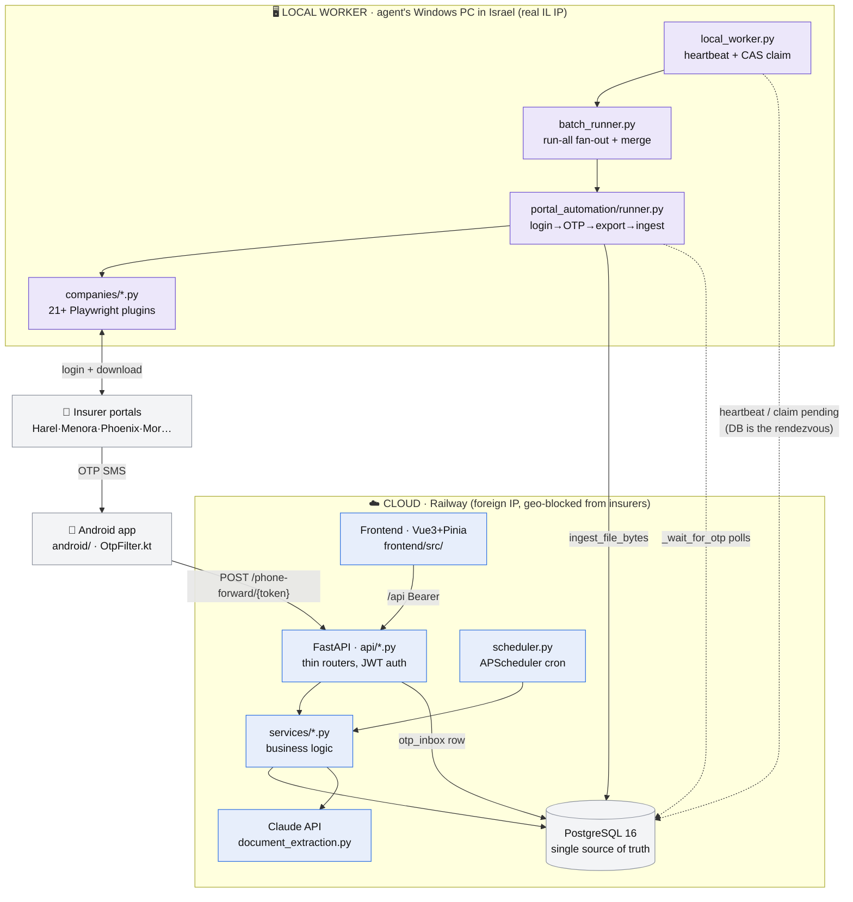
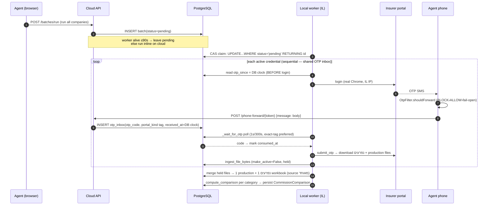

# Nifraim — Architecture Map

> **Purpose of this file.** A machine-readable map of the app so any Claude Code
> session can orient itself *without* being re-briefed. Read this first. The
> Mermaid graphs below render visually on GitHub and encode the module graph +
> data flows; the **Navigation Index** tells you which file owns each concern.
>
> Pair with `CLAUDE.md` (conventions, pitfalls, how-to-add-a-parser). This file
> answers **"how is it wired and where do I look"**; `CLAUDE.md` answers **"how
> do I write code that fits."**

---

## 0. One-paragraph mental model

Nifraim reconciles **production** (what the agent sold — premium/accumulation)
against **נפרעים / commission** (what each insurer actually paid). Files arrive
two ways: manual upload, or **hands-free portal automation**. Because Israeli
insurer WAFs geo-block the cloud IP, automation runs on **two planes**: the
**cloud** (Railway — UI, DB, Claude, analytics) is the brain; a **local worker**
on the agent's Windows PC in Israel is the hands. They never call each other
directly — the **PostgreSQL database is the only rendezvous**. OTP codes flow
from the agent's phone → cloud inbox → worker.

---

## 1. System graph (the two planes)

**Dispatch rule** (`api/portal_automation.py::_should_defer_to_worker`): if the
user's worker heartbeated ≤ **90 s** ago (or global `WORKER_MODE`), a batch stays
`pending` for the worker to claim; otherwise it runs **inline on the cloud**
(where IL portals fail). Installing + running the worker is the only switch.

---

## 2. Navigation index — "where do I look for X"

| I need to change / understand… | Go to |
|---|---|
| **Parse a new insurer Excel format** | `services/parser_service.py` + `utils/hebrew_mappings.py` (see CLAUDE.md "How to Add a Parser") |
| **Hebrew → DB column mapping / format signatures** | `utils/hebrew_mappings.py` |
| **Which reporting month a file is *for*** | `parser_service.py::detect_period_month` |
| **Commission ↔ production matching (paid/unpaid)** | `services/comparison_service.py::compute_comparison` |
| **"Full picture" multi-company comparison** | `services/comparison_orchestrator.py::compute_merged_comparison` |
| **Upload + auto-compare pipeline** | `services/upload_ingest.py::ingest_file_bytes`, `schedule_post_ingest` |
| **Record-level reconciliation & analytics** | `services/reconciliation_service.py` |
| **A single portal run (login→OTP→export)** | `services/portal_automation/runner.py::_run_inner` |
| **"Run all companies" batch** | `services/portal_automation/batch_runner.py::_run_batch_inner` |
| **A specific insurer's automation** | `services/portal_automation/companies/<name>.py` |
| **Merge per-company files into one workbook** | `services/portal_automation/aggregate.py` |
| **Local worker lifecycle / self-update** | `backend/local_worker.py` |
| **Worker endpoints (bundle, heartbeat, update, log)** | `api/portal_automation.py` (`/worker/*`) |
| **OTP webhook / templates / next-otp** | `api/portal_automation.py` (`/phone-forward/*`) |
| **OTP company routing from SMS text** | `services/otp_routing.py::match_otp_company` |
| **Android SMS forwarder logic** | `android/app/.../smsforwarder/OtpFilter.kt`, `SmsReceiver.kt` |
| **Global SMS OTP templates (CRUD/seed)** | `api/sms_otp_templates.py`, `models/sms_otp_template.py` |
| **Claude agreement/rate extraction** | `services/document_extraction.py`, `api/ai_documents.py` |
| **How extracted rates are picked for math** | `services/rate_select.py` |
| **AI chat (streaming)** | `services/ai_service.py::stream_chat` |
| **Customer portal (shareable link)** | `services/portal_service.py`, `api/portal.py`, `CustomerPortalView.vue` |
| **Phoenix native terminal (green-screen)** | `scripts/windows/phoenix_terminal_run.py`, `services/phoenix_mu.py` |
| **Volume report (דוח היקפים, multi-sheet)** | `parser_service.py::_parse_volume_report`, `services/volume_service.py` |
| **Scheduled jobs (cron)** | `backend/app/scheduler.py` |
| **CSS design tokens / RTL root** | `frontend/src/App.vue` (`:root`) |
| **Main workspace UI (5 tabs)** | `frontend/src/views/WorkspaceView.vue` |
| **Comparison dashboard UI** | `frontend/src/components/comparison/ComparisonDashboard.vue` |
| **Workspace tab bar (home cards + strip) + hover FX** | `frontend/src/components/workspace/WorkspaceTabs.vue` |
| **Tab icons (duotone) — single source of truth** | `frontend/src/components/icons/{AppIcon.vue, tabIcons.js}` |
| **Per-tab colour identity tokens** | `App.vue` `:root` (`--tab-*` accent/wash/ink) |
| **Card ambient hover animation (Remotion)** | `remotion/CardAmbientLoop.tsx`, `components/workspace/CardAmbientIsland.vue` |

---

## 3. Hands-free harvest — end-to-end sequence

---

## 4. OTP correctness invariants (do NOT break these)

These look arbitrary; each encodes a fixed production incident.

1. **Anchor `otp_since` on the DB clock, before `login()`.** Not the worker's
   clock (a PC 5 min fast discarded every real code). Before login because some
   portals SMS on credential-submit. — `runner.py::_wait_for_otp`, `_db_utc_now`
2. **Exact company tag beats NULL, via `CASE` sort.** A naive
   `ORDER BY (portal_kind==base) DESC` lets untagged junk (NULL sorts first under
   DESC) steal the code. Codes tagged for *other* companies are excluded. Stops
   cross-company OTP theft in a run-all batch. — `runner.py`, mirrored in `/next-otp`
3. **Body-only forwarding.** The phone drops the sender, so the backend
   re-derives company from body text. Device (`OtpFilter.kt`) and server
   (`otp_routing.py`) share the one **global** `sms_otp_templates` set.
4. **Fail-open on the phone.** Any unlisted-company SMS with a 4–8 digit code is
   still forwarded, so a new insurer never silently drops. BLOCK templates are
   the privacy lever for personal 2FA.

## 5. Comparison / merge invariants

1. **Normalize the national ID.** Production drops leading zeros, commission
   keeps them → `_normalize_id` (`id.lstrip('0') or '0'`) reconciles.
2. **Match products by policy number**, handling the compound
   `X-YYY-ZZZZ-N` form (3rd segment = bare account no.). — `_policy_matches`
3. **Exclude stale מאוחד.** The merged batch file is *derived*; when a fresher
   per-company upload coexists, drop just that company's rows from the merge
   (`exclude_from_merged`), never double-count. — `comparison_orchestrator.py`
4. **Multi-production aware.** Production is one file *per company*; never
   `scalar_one_or_none()` it — aggregate with `.in_(prod_upload_ids)`.
5. `period_month` is **filename-first**, then data dates, then `uploaded_at`. —
   `parser_service.py::detect_period_month`

## 6. Claude (AI) invariants

1. **Forced tool_use** (`tool_choice=save_extracted_document`) → validated dict,
   never text-JSON. Model `claude-sonnet-4-6` → Haiku fallback. — `document_extraction.py`
2. **Literal-value guard.** Every extracted % must appear verbatim in the PDF
   text layer (pdfplumber, or Hebrew OCR if <200 chars) or it's dropped as
   fabricated. — `_normalize_and_validate_rates`
3. **`rates[]` = ongoing נפרעים only.** Scope/היקף/מענק-גיוס/clawback are
   stripped (they'd pollute expected-commission math). Ceilings `0.03` gemel /
   `0.20` insurance are the last guard. — `rate_select.py`

---

## 7. Data model — the tables that matter

| Table | Role | Model file |
|---|---|---|
| `client_records` | The 80+ col fact table (production **and** commission rows) | `models/record.py` |
| `file_uploads` | One row per uploaded/harvested file; `file_category`, `period_month`, `is_production`, `company_source` | `models/upload.py` |
| `commission_comparisons` | Persisted `compute_comparison` result per category | `models/*comparison*` |
| `commission_rates` | Claude-extracted agreement rates (incl. `rate_scope`) | `models/commission_rate.py` |
| `otp_inbox` | Forwarded OTP codes, `portal_kind` tag, DB-clock `received_at` | `models/otp_inbox.py` |
| `sms_otp_templates` | GLOBAL regex templates (allow/block) | `models/sms_otp_template.py` |
| `worker_heartbeats` | One row/user; DB-clock `last_seen`, `update_requested_at` | `models/worker_heartbeat.py` |
| `portal_runs` / `portal_run_batches` | Automation run state machine | `models/portal_run*.py` |
| `portal_links` | Shareable customer-portal tokens | `models/portal_link.py` |

**Universal rule:** every query filters by `user_id` (strict multi-tenancy).

---

## 8. Frontend — workspace nav chrome & icon system

The top chrome a user sees, top→bottom, is `StockTicker` → `WorkspaceTabs`
(the tab bar) → `CircleMenuIsland` (a React-island radial menu holding
settings/logout, lucide-react by name). **The legacy `WorkspaceHeader.vue` is
dead code — not mounted.**

### `WorkspaceTabs.vue` — two render modes, one tab list

One `tabs[]` array drives both:
- **Home mode** — a grid of premium `.card` "cubes" (icon chip + label + desc).
- **Content mode** — a compact sticky `.strip` of pills (active pill tinted).

Each tab owns a **colour identity** via three CSS vars bound inline
(`--accent`, `--accent-glow` wash, `--accent-ink` text-safe): `production`=cobalt,
`comparison`=green, `commission`=purple, `emails`=magenta, `recruits`=turquoise,
`portal`=sky, `ai`=lavender, `automation`=teal. Tokens live in `App.vue :root`
as `--tab-*` → `CHART_PALETTE`. **Orange (`--primary`) is the brand-action colour
only — never a tab identity.**

Home-card **hover** = grow + ambient loop (both were subtle traps):
- **Resize**: `.card:hover` scales to `1.14` + `z-index:5` (grows *over*
  neighbours). ⚠️ `@keyframes cardEnter` ends on `scale(1)`; the card MUST use
  `animation-fill-mode: backwards` (not `both`) or the retained end keyframe
  overrides `:hover`'s transform (animations outrank normal rules) and the card
  silently never resizes.
- **Ambient glow**: `<CardAmbientIsland>` mounts a Remotion loop
  (`CardAmbientLoop`) behind the content, tinted to the card's accent, **only
  while hovered** (`v-if="hoveredCard === id"`) → at most one Player alive.

### Icon system — `components/icons/`

Tab glyphs are a **duotone** set, defined **once** (they used to be inline
Lucide strokes duplicated per size per tab):
- `tabIcons.js` — registry of inner SVG markup, id → glyph. Geometry vendored
  from **Phosphor Duotone (MIT)**; each glyph is two `fill="currentColor"`
  layers, the tint at `opacity≈0.2`.
- `AppIcon.vue` — renders `<svg viewBox="0 0 256 256" fill="currentColor"
  v-html=…>` at a `size` prop.

**Why `currentColor`+opacity matters:** colour flows entirely through the
surrounding `--tab-*` token — accent-ink at rest, white on card-hover, grey on
inactive strip pills — with **zero icon-side colour logic**. Recolour a glyph by
changing its wrapper's colour, never the SVG. The registry is reusable for any
future surface (KPI cards etc.) that still uses ad-hoc inline strokes.

### Remotion-in-Vue (RTL gotcha)

Every Remotion Player mounted here needs `direction: ltr` on its **inner** mount
div only (never the positioned root) — the Player centres with LTR-assuming math
and drifts ~half a scene off-box under the app's RTL root. Directional scenes add
`transform: scaleX(-1)` to flow right-to-left; `CardAmbientLoop` is
non-directional so it doesn't. See `remotion/TabHeroLoops.tsx`,
`AutomationHeroLoopIsland.vue`.

---

*Regenerate this map when the two-plane topology, the OTP routing, or the
comparison/merge selection logic changes — those are the parts a new session
cannot safely infer from reading one file.*
