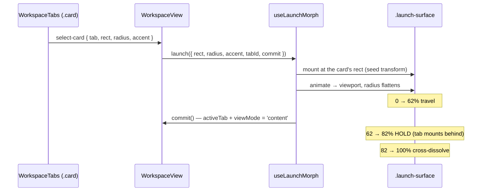

# App launch morph — pressing a home card opens its tab

> Scope: the iOS-springboard transition between the home card grid and a tab.
> Written 2026-09-23. Companion to `docs/ARCHITECTURE.md`; the conventions it
> assumes (design tokens in `App.vue`, RTL root, z-index ladder) live in
> `CLAUDE.md`.

## 1. What it does

Pressing a card on the home grid grows **that card's rectangle** into the tab
it opens; going home folds the view back into the same card. One
`position: fixed` surface does the whole thing.

Dismiss is the reverse, with one asymmetry: `commit()` fires **first**, because
the grid has to exist before the destination card can be measured.

## 2. Files

| File | Role |
|---|---|
| `composables/useLaunchMorph.js` | the whole motion: timing, keyframes, measuring |
| `components/workspace/WorkspaceTabs.vue` | `onCardPress` — the card reports its own rect; `data-tab` for measuring on the way back |
| `views/WorkspaceView.vue` | owns the surface, the glyph, `onCardSelect` / `goHome` |

Timing knobs are the consts at the top of the composable: `OPEN_MS` 680,
`CLOSE_MS` 460, `DIP` 0.955, `OPEN_ARRIVE` 0.62, `OPEN_DISSOLVE` 0.82,
`CLOSE_ARRIVE` 0.72.

## 3. Invariants — each of these was a bug first

**Options-level `easing` stays `linear`.** Setting `easing` on the WAAPI
options *and* on the keyframes compounds the two curves. With
`cubic-bezier(.32,.72,0,1)` in both places the timeline was ~86% complete at
20% of the elapsed time: the travel finished almost instantly, the hold never
happened, and the glyph was gone before it could be seen. No duration fixes
this — it read as "too quick" at every value. The keyframes own the curve.

**It travels on `transform`, never on `left/top/width/height`.** The rect
version was geometrically exact and visibly rough, because animating box
metrics forces a layout pass every frame. The surface is laid out at the full
viewport (`inset: 0`, `transform-origin: 0 0`) and scales *down* to wherever
it should be, which the compositor runs by itself.

**The corner radius is counter-scaled.** `radius / sx`, so a 14px card corner
still reads as 14px the whole way across instead of shrinking with the box.
A trace showing `border-radius: 96px` is correct: 96 × 0.146 = 14 on screen.
Slightly elliptical while `sx ≠ sy`, invisible at this size.

**Scaling down from the viewport is what makes it RTL-safe.** Every position
is a viewport coordinate from `getBoundingClientRect()`. There is not one
direction-aware term in the file, and there must not be.

**The tab mounts during the hold, not during the travel.** Mounting a tab is
heavy — charts, stores, a Remotion island — and doing it mid-travel dropped
frames exactly where the eye was following. `commit()` fires at
`OPEN_ARRIVE + 0.02`, while the surface is stationary and opaque. Any hitch
happens under cover.

**`view-switch` is suppressed while the morph runs.** `WorkspaceView`'s slide
would otherwise play underneath it — two animations arguing over one swap. The
Transition's `name` binds to `view-none` for the duration.

**Dismiss waits for the card, not for a frame count.** The grid sits behind an
`out-in` Transition and is not in the DOM the frame after `commit`. The
composable polls `measureCard` for up to 12 frames. A fixed wait was the
difference between the app folding into its icon and it just vanishing.

**`measureCard` finishes the grid's entrance first.** The cards replay their
staggered `cardEnter` scale-up every time home mounts, so a naive measurement
catches a card mid-entrance and the app folds into a box ~28px short of where
it settles. Finishing them is also right for the moment: coming back, the
springboard is already there — it does not re-deal itself card by card.

**No recede on the way back.** Home receding (`scale(.965)`) is correct as the
app comes *forward*; on the way back it would move the very card being landed
on.

## 4. The two things that make it read as a press

Without either, the travel is a featureless box growing and reads as a flash.

- **The dip.** 4.5% compression over the first 8% of the travel. iOS
  compresses the icon under your finger; doing it inside the animation buys
  the same read without adding latency to the click.
- **The glyph.** The tab's own `AppIcon`, centred in the surface, swelling and
  dissolving over the first half. It lives inside the surface so it inherits
  its scale, and its own animation counter-scales it — it starts at exactly
  the 22px it was on the card. Colour comes from `ANIM_COLORS[tab.id]` in
  `WorkspaceTabs.vue`; a tab missing an entry there gets no glyph tint and no
  ambient hover loop (that gap is how `maslaka` was found).

## 5. Where it does NOT apply

Only a press on a home card morphs. The strip pills, the setup wizard, the
batch toast and the command menu have no rectangle to grow from, so
`onCardSelect` falls through to a plain switch — the `payload.rect` check is
what distinguishes them. `prefers-reduced-motion` skips the morph entirely and
falls back to the existing `view-switch` slide.

## 6. Verifying a change

`vite build` proves nothing here, and neither does a screenshot — a still
cannot show a spring. Two checks, both scripted with Playwright:

- **Trajectory.** Sample `.launch-surface`'s `getBoundingClientRect()` every
  25ms through a launch. It must start at the card's rect and end at
  `0,0 × innerWidth,innerHeight` (and the reverse on close, landing on the
  card's *current* rect — if the cursor is hovering it, the hovered rect is
  the right answer).
- **Timeline.** Pause the surface's and glyph's animations, then step
  `currentTime` to 0 / 20 / 40 / 62 / 82% and screenshot. This is the check
  that catches compounded easing: at 20% the surface must be mid-travel, not
  already arrived.

Record with `record_video_dir=` when the question is "does it feel right" —
that is the only artefact that answers it.
